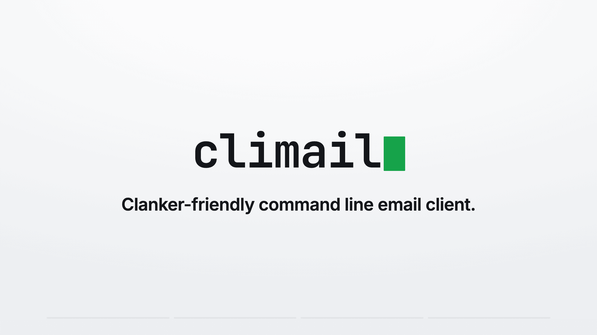

# 📬 climail

**Clanker-friendly command line email client.**

- 📬 Read, write & organize emails
- ⚡ Run instantly with `npx` (no install)
- 🔐 IMAP + SMTP
- 💌 Gmail ready

Built for clankers 🤖 (and humans, too!)

---

[](https://github.com/user-attachments/assets/646fd5e5-77b9-4260-b263-2876f58991dd)

## ✅ Features

### NPX commad, zero install

`npx climail` it's all you need: `npx climail search`, `npx climail mark 167 read`, `npx climail archive 167`, etc.

### Easy to configure

Run `npx climail init` and the wizard will guide you to setup your email credentials. The file is stored in `~/.config/climail.conf`. See [configuration](#configuration) below.

### JSON responses

Every command responds clean JSON on stdout, so it drops straight into scripts, pipelines, and agent workflows without scraping terminal output.

### Gmail-ready

Labeling, archiving (dropping the `Inbox` label instead of trashing), and starring (`\Flagged`) work out of the box, with no per-provider config blocks to hand-roll.

## 📨 Usage

```bash
npx climail <command>
```

### Commands

| Command | Description |
|---------|-------------|
| `init` | Setup wizard for your IMAP credentials. Writes `~/.config/climail.conf`. |
| `list` | List recent messages as JSON, including each message's UID. Flags: `--count <n>` (default 10), `--unread` (unread only), `--mailbox <name>` (folder to list, default INBOX). |
| `search` | Search a mailbox (default INBOX). Flags: `--from`, `--to`, `--subject`, `--body`, `--text`, `--since <date>`, `--before <date>`, `--unread`, `--count <n>` (default 25), `--mailbox <name>` (folder to search, default INBOX). With no criteria, returns the most recent messages. |
| `labels` | List available labels/folders, with special-use flags. Flag: `--counts` adds total and unread message counts per label (one extra round trip each). |
| `read <uid>` | Fetch one message by UID: parsed body (text + html) and attachment metadata. Flags: `--save-attachments <dir>` writes attachments to disk and returns their paths; `--mailbox <name>` reads from a folder other than the Inbox. |
| `label <uid> <name>` | Apply a Gmail label to a message. Gmail labels are mailboxes, so the message is copied into the label (it stays in its source mailbox). Creates the label if needed. Flag: `--mailbox <name>` labels a message in a folder other than the Inbox. |
| `mark <uid> <action>` | Set message flags. Actions: `read`/`unread` (toggle `\Seen`), `flag`/`unflag` and the aliases `star`/`unstar` (toggle `\Flagged`). Flag: `--mailbox <name>` marks a message in a folder other than the Inbox. |
| `draft-reply <uid>` | Stage a threaded reply to a message in the Drafts folder. Flags: `--body "<text>"`, `--all` (reply to everyone: sender in To, other recipients in Cc). **Drafts only, nothing is sent** (IMAP cannot send; that needs SMTP). Review and send from your mail client. |
| `send` | Send mail over SMTP (requires `smtp.host`). Three modes: a new email (`--to`, `--subject`, `--body`); a threaded reply (`--to`, `--reply-to <uid>`, `--body`, which carries `In-Reply-To`/`References`, add `--all` for reply-all); or an existing draft (`--draft <uid>`, which sends it and removes it from Drafts). Extras for new/reply: `--cc a,b`, `--bcc a,b`, `--html "<p>…"`, `--attach file1,file2`. |
| `forward <uid>` | Forward a message to a new recipient over SMTP. Flags: `--to <address>` (required), `--body "<note>"`. Keeps the original's attachments. |
| `delete <uid>` | Delete a message. On Gmail this moves it to Trash. Flag: `--from <mailbox>` deletes from a mailbox other than the Inbox (e.g. `Drafts`, `[Gmail]/All Mail`). |
| `archive <uid>` | Archive a message. On Gmail this drops the Inbox label (keeping it in All Mail) rather than trashing it; on other servers it moves to the Archive folder. |
| `move <uid> <mailbox>` | Move a message from the Inbox to another mailbox. |

### Examples

```bash
npx climail init
npx climail list --unread
npx climail search --from boss@work.com --since 2026-06-01 --unread
npx climail labels --counts
npx climail read 167 --save-attachments ./att
npx climail mark 167 read
npx climail list --mailbox "[Gmail]/All Mail" --unread
npx climail mark 167 read --mailbox "[Gmail]/All Mail"
npx climail label 167 Triaged
npx climail draft-reply 167 --all --body "Thanks, will take a look."
npx climail send --to them@example.com --reply-to 167 --all --body "On it."
npx climail send --to a@b.com --subject "Report" --body "Attached." --attach ./report.pdf
npx climail forward 167 --to colleague@work.com --body "FYI"
npx climail archive 167
```

## ⚙️ Configuration

Run `npx climail init` to create a config file at `~/.config/climail.conf`, or write one yourself:

```
imap.host=imap.gmail.com
imap.port=993
imap.secure=true
imap.username=you@gmail.com
imap.password="app password here"

# Optional: only needed for the `send` command
smtp.host=smtp.gmail.com
smtp.port=465
```

SMTP authenticates with the same username/password as IMAP by default. To use a
different SMTP login, add `smtp.username` and `smtp.password`.

`init` asks where to save the config:

- **Global** — `~/.config/climail.conf` (following the XDG convention), so climail
  works from any directory.
- **Local** — `climail.conf` in the current directory, handy for a per-project
  mailbox. A local config takes precedence over the global one when you run
  commands from that directory.

Point at a different file with `--config <path>` on any command (this also skips
the scope prompt in `init`):

```bash
npx climail list --config ~/work/mail.conf --unread
```

> Gmail requires an **app password**, not your account password. Keep your config
> file out of version control — it holds your credentials.

## 🤖 Skill for your agent

Teach your agent (Claude Code, Codex, Copilot, Cursor) how to use climail. Install the skill:

```bash
npx skills add nicodevs/climail
```

See [`skills/`](./skills/) for manual install and details.

## ▶️ Requirements

Requires Node >= 22.

## 👨‍💻 Contributing

Setup, toolchain (`vp`), build, hooks, and release automation are documented in [CONTRIBUTING.md](CONTRIBUTING.md).
